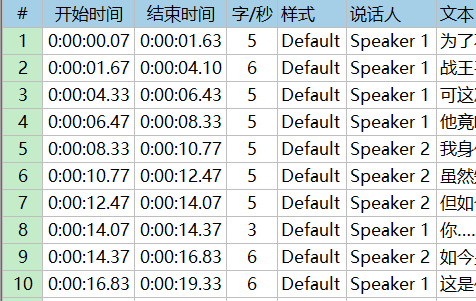
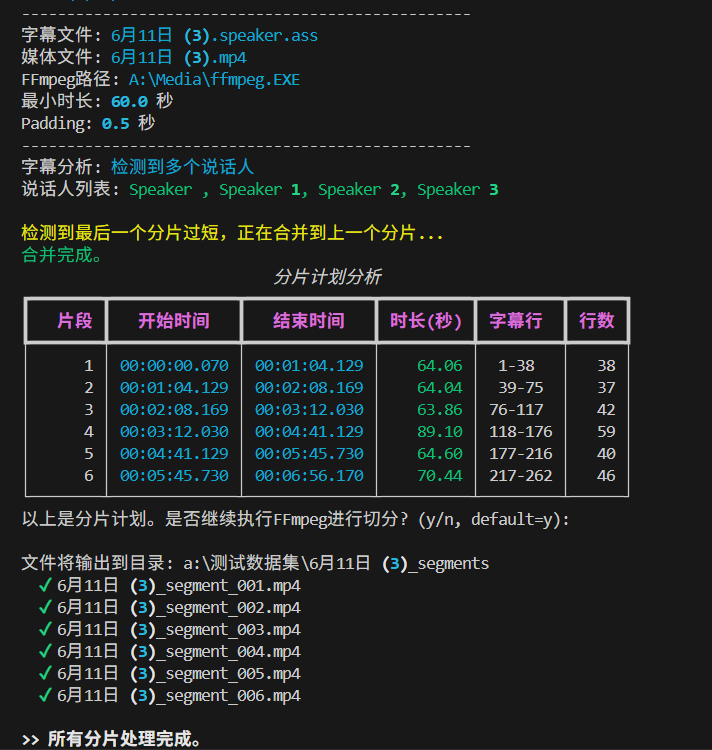

# Split Subtitle
为字幕添加说话人，根据时长和说话人对音频视频分割

本项目不提供技术支持

## 项目结构
包含3个主要文件
1. bat脚本，方便Windows系统使用
2. `speaker2.py`: 使用pyannote项目的模型对说话人进行分析，最后在字幕中添加说话人信息

3. `split_time.py`: 使用字幕对音频视频进行分割，让每个片段都达到一定时长，并且同一说话人的内容不被截断。


## 安装环境
安装python（建议3.11）后为python设置加速镜像
```
python -m pip install -i https://mirrors.tuna.tsinghua.edu.cn/pypi/web/simple --upgrade pip
pip config set global.index-url https://mirrors.tuna.tsinghua.edu.cn/pypi/web/simple
```

直接安装torch
`pip3 install torch torchvision torchaudio --index-url https://download.pytorch.org/whl/cu126`
或者镜像安装torch
```
pip install https://mirrors.aliyun.com/pytorch-wheels/cu126/torch-2.7.1+cu126-cp310-cp310-win_amd64.whl  https://mirrors.aliyun.com/pytorch-wheels/cu126/torchaudio-2.7.1+cu126-cp310-cp310-win_amd64.whl https://mirrors.aliyun.com/pytorch-wheels/cu126/torchvision-0.22.1+cu126-cp310-cp310-win_amd64.whl
```

安装pipy包
```
pip install  pysubs2 pyannote.audio tqdm rich 
```

放置ffmpeg到程序目录

修改`speaker2model.py`中的huggingface token信息，在hf签署模型协议并下载模型。


## 使用
Windows环境下直接点击bat启动，根据提示操作即可。
可自行根据需求去除不需要的部分或者修改参数。
或者直接使用参数调用Python脚本。
